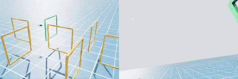
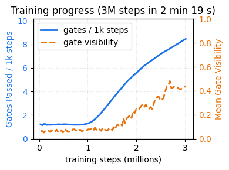

# Drone Racing in Isaac

[](https://opensource.org/licenses/MIT)


MWE of training and flying an RL quadrotor racer on **current** Isaac Sim (
pip-installed. 5.1 on branch `develop`, **6.0 on branch `isaacsim-6.0`**).



We demonstrate how to integrate Isaac Sim with RL drone control research in the
following ways:

1. We simulate a racing drone and a racecourse in Isaac Sim, with one
   modification: the drone's uses the TU Delft **motor-effectiveness model**,
   i.e., moments are functions of motor speeds and accelerations, independent of
   the classical inertia tensor. Simulating here is ideal for validating learned
   policies, and the drone can be extended with USD sensors such as our **FPV
   camera**. However, training in Isaac Sim is **slow**,

2. Alternatively, we train a racing policy with PPO in a vectorized pure-NumPy
   environment in **minutes**, then evaluate it in Isaac Sim without fine-tuning
   for sim-to-sim transfer.

This project combines lessons learned from two established codebases:

- [Pegasus Simulator](https://github.com/PegasusSimulator/PegasusSimulator/tree/main)
  - This drone simulation framework showed us some proven practices of
    integrating with PhysX.

- [`optimal_quad_control_RL`](https://github.com/tudelft/optimal_quad_control_RL)
  - The implementation of **One Net to Rule Them All: Domain Randomization in
    Quadcopter Racing Across Different Platforms**, which offered us the
    motor-effectiveness dynamics and domain-randomization formulation.

We also add perception-aware reward shaping so the drone flies nose-first with
the target gate in frame. Results below show it costs nothing in gate traversal
rate while cutting crashes and raising mean gate visibility — a step toward
vision-based (image-to-action) control on PhysX. Contributors welcome!

## Results

We measured our performance on a laptop (i7-14650HX, RTX 4060 Laptop 8 GB,
driver 580.159, Isaac Sim 5.1.0 pip wheels, Python 3.11). We collected the
following results by running `uv run examples/eval.py`, analyzing the policy in
`examples/models/race_ppo_perception.zip`.



The packaged and baseline policies each fly a 1200-step episode on Isaac PhysX:

| Policy                                | Result on Isaac PhysX                          | Reproduce                                                                                       |
| ------------------------------------- | ---------------------------------------------- | ----------------------------------------------------------------------------------------------- |
| Packaged perception-aware             | **25 gates (3.12 laps)**, nose-first, no crash | `uv run examples/demo.py session.headless=true`                                                 |
| Freshly trained baseline (no shaping) | **30 gates (3.75 laps)**, no crash             | `uv run examples/demo.py session.headless=true session.demo.model=train_out/race_ppo_final.zip` |

## Running the code

### Dependencies

We use `uv` to manage the Python environment and dependencies. On Ubuntu, these
commands set up `uv` for you:

```bash
sudo apt-get install pipx
pipx ensurepath
pipx install uv
```

### System Prerequisites

`uv` ensures that a compatible Python 3.11 is installed. However, we currently
use Isaac Sim 5.1, which requires an NVIDIA RTX GPU and a recent driver. This
repo is developed and verified on the 580-series driver (580.159):

```bash
sudo apt-get install nvidia-driver-580
```

### Running the demo

After cloning this repo, run the flight demo (using the packaged pre-trained
policy):

```bash
UV_HTTP_TIMEOUT=300 uv run examples/demo.py session.headless=false session.fpv.enabled=true
```

where `session.headless=false` opens a window to watch the flight, and
`session.fpv.enabled=true` adds a second viewport showing the FPV camera view.
The demo prints `gates_passed` and `laps` at the end of the episode.

> [!NOTE]
>
> The first run pulls ~GBs of Isaac Sim wheels from `pypi.nvidia.com`, so
> `UV_HTTP_TIMEOUT=300` is recommended to avoid a timeout on slower connections.

### Training a new policy

Three first-class backends (see [Three training backends](#three-training-backends)) —
train on whichever plant and speed you need; none is the "real" one.

**Analytic NumPy twin** — effectiveness model, finishes in minutes:

```bash
uv run examples/train.py session.train.domain_randomization=true
```

`session.train.domain_randomization=true` resamples all 23 model parameters ±10% each
episode (`optimal_quad_control_RL`-style); add `experiment=perception_aware` for the
gate-visibility + nose-first shaping instead of the bare progress reward.

**GPU-parallel Isaac Lab** — the classical PhysX plant at scale (~257k steps/s; needs the
`isaaclab` group):

```bash
env -u PYTHONPATH OMNI_KIT_ACCEPT_EULA=YES uv run --group isaaclab \
  python -m isaacracelab.train --num_envs 4096 --headless
```

**Single-env Isaac** — full PhysX, one drone, a high-fidelity check (~240 steps/s):

```bash
uv run examples/train.py session.train.backend=isaac
```

Evaluate any checkpoint without booting Isaac:

```bash
uv run examples/eval.py session.demo.model=train_out/race_ppo_final.zip
```

and fly it on Isaac:

```bash
uv run examples/demo.py session.headless=false session.demo.model=train_out/race_ppo_final.zip
```

Optionally, toggle between mirroring the Delft motor-effectiveness model used in
training and a classical PhysX-native rigid-body model with
`session.demo.dynamics=kinematic` or `classical`.

```bash
uv run examples/demo.py session.headless=false \
  session.demo.model=train_out/race_ppo_final.zip \
  session.demo.dynamics=classical
```

## Design

### Modeling the drone dynamics

Our drone dynamics is a faithful implementation of TU Delft 5-inch-quad model
(`dynamics.py`, verified against the reference sympy implementation from
[`optimal_quad_control_RL`](https://github.com/tudelft/optimal_quad_control_RL/blob/icra2025/quad_race_env.py)
in `tests/test_dynamics.py`).

The model contributes to _cross-platform generalizability_ by dropping the
classical rotational dynamics formulation. A racing quad's moments are dominated
by motor speed effects such as thrust asymmetries, rotor drag, and the yaw
reaction of motor accelerations, which a constant inertia tensor captures poorly
even when measured accurately. Instead, 23 learned per-platform parameters map
motor speeds and accelerations directly to angular acceleration. This is more
accurate for this vehicle class, and since those parameters characterize the
airframe, porting is just re-identifying them. Motor lag is in the model as a
first-order term, so the policy commands motors rather than body rates and
learns the actuation delay.

To reproduce that model in Isaac Sim, our `RacingDrone` treats translation and
rotation separately. At each step (100 Hz, one RL action per physics step):

- **Translation** is left to PhysX. We apply the model's body-frame thrust and
  drag as a force and let PhysX add gravity and integrate position/velocity.
- **Rotation** is integrated **kinematically**: we evaluate the model's
  analytical angular acceleration, advance the body rates by one explicit-Euler
  step, and write them directly to the rigid body. No torque is applied, so the
  asset's inertia tensor and PhysX's gyroscopic terms never enter the loop.

Alternatively, you can swap in a `classical` rotational dynamics formulation:
apply per-rotor thrust at the arm tips and let PhysX build the roll and pitch
moments through presumably standard rigid body dynamic laws. Handling yaw is
more subtle: in addition to the typical rotor drag torque, we also have to
account for **the rotor angular-momentum reaction** (the equal-and-opposite
torque of spinning the rotors up and down), which textbook multirotor models
routinely omit even though it contributes substantial yaw-authority on a racing
quad.

The `classical` rotational dynamics turn the Isaac Sim drone into a structurally
different validation target: a policy trained on the effectiveness model flies
it zero-shot, with no fine-tuning, showing that the policy is general.

### Three training backends

Three co-equal ways to generate experience — pick by the plant you want and the speed
you need. None is subordinate; they target different sim-to-real bets.

| backend | plant | throughput | role |
| --- | --- | --- | --- |
| **Analytic batched** `BatchedRaceEnv` | effectiveness model (NumPy) | ~375k steps/s | fastest iteration; the analytic twin |
| **GPU-parallel Isaac Lab** `RacerEnv` | classical, PhysX on GPU | ~257k steps/s @ 2048 envs | the real engine at scale |
| **Single Isaac** `RaceEnv` | full PhysX, one env | ~240 steps/s | high-fidelity reference / check |

The two batched backends are the **same order of magnitude** (~257k vs ~375k steps/s) and
finish a 3M-step PPO run in minutes; single-env Isaac is ~1500× slower — a faithful reference,
not a workhorse. The analytic twin trains the _effectiveness_ model and the Isaac Lab path the
_classical_ PhysX model — two different sim-to-real bets — and a policy trained in the analytic
twin transfers to PhysX with no fine-tuning (Results above). The analytic + single-Isaac
backends are the framework-free core (`examples/train.py`, `backend=batched|isaac`); the GPU
path is the sibling [`isaacracelab`](src/isaacracelab/) package (`python -m isaacracelab.train`).
See [`src/isaacracelab/README.md`](src/isaacracelab/README.md).

### Handling frame conventions

We and Pegasus Simulator both encountered the challenge that autopilot
frameworks that Pegasus Simulator supports (e.g. PX4, Ardupilot), the TU Delft
model (Betaflight-descended), and Isaac Sim use different coordinate
conventions:

| Frame | PX4/Ardupilot/Betaflight | Isaac Sim |
| ----- | ------------------------ | --------- |
| World | NED                      | ENU       |
| Body  | FRD                      | FLU       |

`isaacrace/conversions.py` handles this with axis permutations and sign flips
for vectors, and a closed-form constant-quaternion product for attitudes. While
our approach is more performant than using rotations to handle the frame
transformations, our conversion functions are tested against the equivalent
rotation-based approach in `tests/test_conversions.py`.

### Managing the Isaac Sim dependency

We consume Isaac Sim 5.1 as the pip `isaacsim` package (cp311) from NVIDIA's
index (`pypi.nvidia.com`), pinned in `pyproject.toml` and locked in `uv.lock` —
as opposed to the classic approach of downloading a .zip installation of the
entire Isaac Sim app and patching `PYTHONPATH` to use it. This makes the Isaac
Sim version a per-venv, per-project decision, which is only possible on modern
Isaac since it now ships as ABI-tagged wheels built for stock CPython 3.11.

> [!WARNING]
>
> A known legacy surface is that the drone is actuated through the deprecated
> `omni.isaac.dynamic_control` extension; migrating to the tensor APIs is future
> work.

## Scope and non-goals

This repo is a deliberately constrained MWE of one research idea:

- nonstandard (effectiveness-formulation) drone dynamics on Isaac Sim, with a
  fast analytic twin for training,

and a few engineering perks:

- Modern pip-installation of Isaac Sim
- FPV camera integration with a Isaac Sim drone model

It is **not** a simulation framework that accommodates non-Quadrotor vehicles
and multiple vehicles.

It offers **three co-equal training backends** (above): the analytic effectiveness-model
twin, single-env PhysX, and GPU-parallel PhysX via Isaac Lab
([`src/isaacracelab/`](src/isaacracelab/)) — train on whichever plant fits the bet. Isaac
Lab is a first-class path (its own `isaacracelab` package + an opt-in `isaaclab` dependency
group), kept a *sibling* of the framework-free core rather than entangled with it; we
onboarded it directly instead of adopting
[Aerial Gym](https://ntnu-arl.github.io/aerial_gym_simulator).

Vision-in-the-loop (UVP) is **under active exploration** on that GPU track (the in-flight
scripts live in [`experimental/`](experimental/)): an FPV camera renders the gates the policy
must read, and the current direction is a modular perception→control architecture (a
supervised image→state net feeding the state racer). Not yet a validated capability.

## Notes

- `dynamics.py`, `course.py`, `config.py`, `state.py`, `conversions.py`,
  `perception.py`, and `env_batched.py` are Isaac-free and safe to import
  anywhere — enforced by `tests/test_isaac_free.py`, not just convention.
  `quadrotor.py`, `camera.py`, and `env.py` import `isaacsim`/`pxr`, so a
  `SimulationApp` must exist **before** importing them. `demo.py`/`train.py` are
  `@hydra.main` entry points that boot the app inside `main()`, then import
  `RaceEnv` — follow that order in any new entry point.
- Config is hydra + plain dataclasses: `conf/config.yaml` composes a `track`
  group (the racecourse) and a `session` group (sim + PPO settings);
  `RaceCourse(track_cfg)` turns the track into gate geometry. Swap
  `conf/track/*.yaml` to race a different course, or activate a profile like
  `experiment=perception_aware`.

## Shoutouts

Similar projects:

- [Pegasus Simulator](https://github.com/PegasusSimulator): Actively developed
  Isaac simulation framework. Supports integration with PX4 and Ardupilot,
- [Isaac Drone Racer](https://github.com/kousheekc/isaac_drone_racer):
  Alternative Isaac drone racing framework. Isaac 4.5. Most recent commit 6
  months ago.
- [Omnidrones](https://github.com/btx0424/OmniDrones): Isaac multi-drone
  simulation framework. Isaac 4.5.
  [Unmaintained](https://github.com/btx0424/OmniDrones#future-of-this-project).
